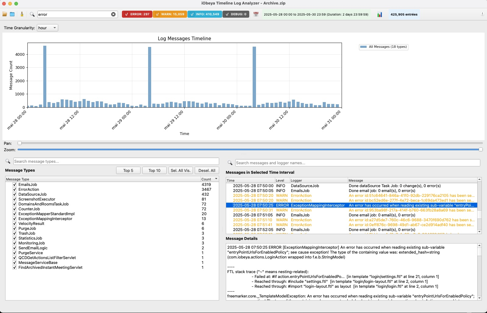

# iObeya Timeline Log Analyzer

## Overview

The iObeya Timeline Log Analyzer is a Python-based desktop application designed for viewing and analyzing application log files. It provides an interactive timeline visualization, powerful filtering capabilities, and memory-efficient handling of large log datasets, making it easier to navigate, understand, and troubleshoot log data.



## Key Features

*   **Welcome Screen**: A user-friendly startup panel with quick access to load a single file or a log archive.
*   **Flexible Log Loading**:
    *   Load individual log files (`.log`, `.log.gz`).
    *   Load compressed log archives (`.zip`) containing both plain text and gzipped logs.
*   **Advanced Archive Filtering**: When loading archives, a dialog allows you to:
    *   Filter files by a specific **date range**.
    *   Filter files by type: **All Logs**, **Application Logs (`app*`)**, or **Error Logs (`error*`)**.
*   **Interactive Timeline Visualization**:
    *   View log event distribution over time.
    *   Adjustable granularity (Day, Hour, Minute) for the timeline display.
    *   Zoom and pan capabilities on the timeline.
    *   When more than 10 message types are selected, their individual bars in the timeline are aggregated into a single "Other Types" bar to maintain clarity.
*   **Powerful Filtering & Search**: Combine multiple filters for precise analysis:
    *   **Full-Text Search**: Instant search on the entire content of all log messages using a high-performance SQLite FTS5 index.
    *   **Log Level Filtering**: Use checkable buttons (INFO, WARN, ERROR, DEBUG) in the toolbar to select multiple levels simultaneously.
    *   **Message Type Filtering**: Select specific message types from the list on the left.
    *   **Time Range Filtering**: Click and drag on the timeline to isolate events in a specific time window.
    *   **Coherent Filtering**: Applying a full-text search or a log-level filter will also dynamically update the list of available Message Types to only show relevant types.
*   **Detailed Log View**: Select a log entry from the list to see its full, multi-line content in a dedicated details panel.
*   **Statistics Panel**: View summary statistics and a Pareto chart of the most frequent message types.
*   **Memory Efficient**: Utilizes pandas DataFrames and on-demand loading of full log entries to handle very large files.
*   **About Dialog**: Includes application version, copyright information, and a fun hidden easter egg.

## Installation and Running

1.  **Clone the Repository**
    ```bash
    git clone git@github.com:jreveliobeya/timeline_iobeya_log_analyzer.git
    cd timeline_iobeya_log_analyzer
    ```

2.  **Install Dependencies**
    The project requires `PyQt5` and `pandas`. Install them using pip:
    ```bash
    pip install PyQt5 pandas
    ```

3.  **Run the Application**
    ```bash
    python iobeya_log_analyzer.py
    ```

## Using the Analyzer

1.  **Loading Logs**: From the welcome screen or the main toolbar, choose one of the following:
    *   **Load Single Log File**: Select and load a single `.log` or `.log.gz` file.
    *   **Load Log Archive**: Select a `.zip` archive. A dialog will appear, allowing you to filter files by date and type before loading:
        
        *   Use the **Filter by type** dropdown to narrow down files (e.g., show only `app*` logs).
        *   Select a **Start Date** and **End Date** using the calendar widgets.
        *   The file list updates automatically. Click "OK" to load the selected files.
    *   A progress dialog will show the loading status. Once loaded, the main UI will appear.

2.  **Navigating the UI**:
    *   **Toolbar**: Contains actions for loading files/archives, resetting the view, and viewing the "About" dialog.
    *   **Timeline Section**: Displays the log event distribution over time. Click and drag to select a time range.
    *   **Message Types Panel (Left)**: Lists all unique message types. Use the checkboxes and search bar to filter.
    *   **Selected Messages List (Center)**: Displays log entries matching the current filters.
    *   **Details Panel (Right)**: Shows the full, multi-line content of the selected log entry.

3.  **Applying Filters**:
    *   All active filters (Log Level, Message Type, Time Range, Text Search) are combined to refine the displayed log entries.
    *   Click the "Reset View" button in the toolbar to clear all filters and reset the timeline zoom.

4.  **Viewing Information**:
    *   Click the **📊** button to open the statistics dialog.
    *   Click the **ℹ️** button on the far right of the toolbar to open the "About" dialog.

## Known Issues / Future Enhancements

*   Support for more diverse log formats.
*   Add more chart types to the statistics panel.

## Version History

*   **v4.1.0** (Current)
    *   **Feature**: Integrated high-performance full-text search using SQLite FTS5.
    *   **Feature**: Restored and enhanced the main toolbar with checkable log level filters and a search widget.
    *   **Feature**: Implemented coherent filtering, where search and log level filters dynamically update the Message Types list.
    *   **Fix**: Resolved multiple bugs, including crashes in the statistics panel and logical errors in filter application.
    *   **UI**: Improved general UI stability and responsiveness.

